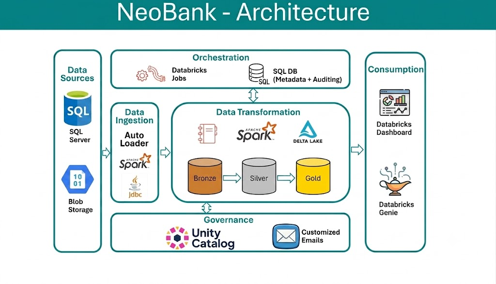
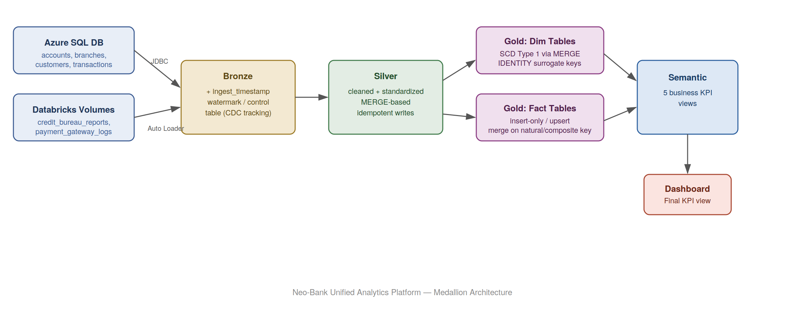

# Neo-Bank Unified Analytics Platform

A production-style, end-to-end data engineering pipeline on Databricks, implementing a medallion architecture (Bronze->Silver->Gold->Semantic Layer) for a fictional Neo-Bank. Built to demonstrate real-world patterns for metadata driven ingestion, incremental processing, idempotent transformations and business facing analytics.

## Table of Contents

1. Project Overview
2. Architecture Overview
3. Tech Stack
4. Data Sources
5. Layer-by-Layer Design
6. Key Engineering Decisions
7. Repository Structure
8. Dashboard
9. Orchestration
10. Know Issues and Roadmap
11. How to run the project

## 1. Project Overview

This project integrates the Neo-Bank data stored in multiple sources, formats i.e customer, account, branch and transaction data flowing in from an operational database, blended with external file-based feeds(credit bureau reports, payment gateway logs) into a unified analytics platform.This provides business users with self service analytics for operational and risk insights.

## 2. Architecture Overview





## 3. Tech Stack

| Component             | Technology                                         |
| --------------------- | -------------------------------------------------- |
| Compute/Platform      | Databricks Free edition                            |
| Governance            | Unity Catalog                                      |
| Data Sources          | Azure SQL Database, Databricks Volumes             |
| Data Ingestion        | Apache Spark JDBC Connector, Databricks Autoloader |
| Orchestration         | Databricks Jobs                                    |
| Transformation        | Pyspark, Spark SQL                                 |
| Dimensional Modelling | Snowflake Schema (facts and dimensions)            |
| Source Control        | Github via Databricks Repos                        |
| Visualization         | Databricks Dashboards                              |

## 4. Data Sources

- Azure SQL Database - accounts, branches, customers, transactions - pulled via spark jdbc connector
- Databricks Volumes (Flat Files) - credit_bureau_reports, payment_gateway_logs - ingested via Auto Loader for schema evolution and incremental file discovery.

## 5. Layer-by-Layer Design

## Bronze

- In bronze layer we ingest the raw source data as it is without any changes and add the ingestion_timestamp() column for audit purposes.
- We use table_watermarks meatadata table to keep track of the watermark value for each sql database table and using it we perform the incremental load from source to bronze layer.
- For flat files we use autoloader to achieve incremental processing through check points.

## Silver

- In silver layer we use watermark value to ingest only new data from bronze layer
- Have used Delta Merge to achieve idempotency including insert-only merge for append-style sources
- After successful load into the silver layer watermark value is updated in the table_watermarks metadata table

## Gold

- Dimension tables: Implemented SCD Type1 via MERGE i.e (whenMatchedUpdate/whenNotMatchedInsert), with GENERATED ALWAYS AS IDENTITY surrogate keys
- insert only merge on natural keys for append only fact sources
- dim_date: a static, determinstic date dimension generated once, excluded from the sheduled pipeline

## Semantic Layer

- Five business-facing views translating gold tables into KPIs consumable by the dashboard

## Dashboard

- Built directly on the semantic views, so BI logic stays out of the dashboard layer and lives in version controlled SQL.

## 6. Key Engineering Decisions

- Used Identity columns in databricks to generate surrogate keys for dimension tables
- Used Delta Merge in silve and gold layer to achieve idempotency
- Used SCD Type1 for updating dimension data
- Used Databricks Secret Scope to store the azure sql database connection credentials

## 7. Repository Structure

```
.
├── docs
│   ├── data_dictionary.md
│   └── dimensional_model.md
├── images
│   ├── architecture_1.png
│   ├── architecture_2.png
│   ├── Branch Insights.png
│   ├── Customer Insights.png
│   ├── Executive Dashboard.png
│   ├── Neo bank master pipeline.png
│   └── Transaction Channel Insights.png
├── Notebooks
│   ├── 01-common
│   │   └── 00_Create_Gold_DDL.ipynb
│   ├── 02-setup
│   │   ├── 01.Catalog and Schema Setup.ipynb
│   │   ├── 02.Setup_Metadata.ipynb
│   │   └── 03.Setup Secret Scope.ipynb
│   ├── 03-bronze
│   │   └── Data Ingestion into Bronze Layer.ipynb
│   ├── 04-silver
│   │   └── Bronze to Silver.ipynb
│   ├── 05-gold
│   │   ├── 01.Dimension customers.ipynb
│   │   ├── 02.Dimension accounts.ipynb
│   │   ├── 03.Dimension branches.ipynb
│   │   ├── 04.Dimension Date.ipynb
│   │   ├── 05.Fact transactions.ipynb
│   │   ├── 06.Fact credit_bureau_reports.ipynb
│   │   └── 07.Fact payment_gateway_logs.ipynb
│   ├── 06-analytics
│   │   ├── 01.branch performance view.ipynb
│   │   ├── 02.customer_360 view.ipynb
│   │   ├── 03.daily bank KPI view.ipynb
│   │   ├── 04.risk customer summary view.ipynb
│   │   └── 05.transaction channel summary view.ipynb
│   └── 08-dashboards
│       └── Neo Bank Final Dashboard.lvdash.json
├── README.md
└── source_files
    ├── blob
    │   ├── credit_bureau_reports_1.csv
    │   ├── credit_bureau_reports_2_incremental.csv
    │   ├── payment_gateway_logs_1.csv
    │   └── payment_gateway_logs_2_incremental.csv
    └── sql_server
        ├── 01_Create_Tables.sql
        ├── 02_Insert_Historical_data.sql
        └── 03_Incrementat_data.sql
```

## 8. Dashboard

The dashboard is built on top of business facing views instead of raw or transaction tables reflecting the industry best practice.


## 9. Orchestration


## Known Issues and Roadmap

- Implemented SCD Type1 for dimension tables and will updated it to SCD Type2 in future.
- Currently, the project does not capture pipeline run metadata. This functionality is planned for a future enhancement.
  
## How to run the project

1. create the azure sql source using sql_server files in source_files folder
2. Run the setup notebooks for catalog and schema setup, metadata tables setup and secret scope setup
3. Deploy the pipeline as Databricks Asset Bundle
4. Run the one time gold DDL Notebook, date dimension Notebook
5. Start the pipeline

## Notes:

i have taken below github repo as reference and built the project end to end from scratch on my own.
https://github.com/databeli/databricks_course/tree/main/13_Banking_Project
